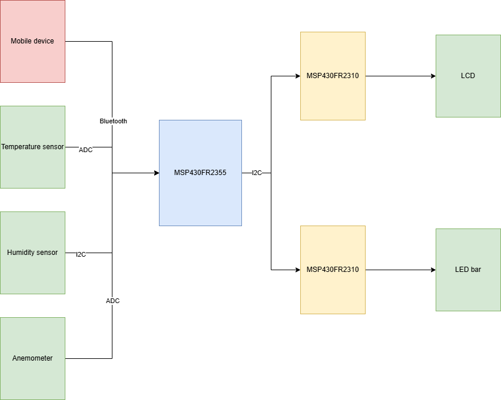

# Final project proposal

- [x] I have reviewed the project guidelines.
- [x] I will be working alone on this project.
- [x] No significant portion of this project will be (or has been) used in other course work.

## Embedded System Description

The goal of this project is to create a small, portable weather station that measures temperature, wind speed, and humidity. The data it measures will be displayed on the LCD screen and the LED bar will display the level of either the humidity or wind speed, with zero LEDs turned on indicating low levels, and all LEDs turned on indicating very high levels. The system will be controlled with a HC-05 bluetooth module that connects to the users cell phone and will interface with the MSP430FR355 through UART.
The wind speed will be measured using an Adafruit anemometer wind speed sensor, which outputs an analog voltage that can be analyzed using the ADC on the MSP430. An external power source will need to be found, as the anemometer requires at least 7 volts. The humidity will be measured by an Adafruit AM2320 sensor, which will interface with the MSP430FR2355 using I2C. The temperature will by measured using a Mouser LM19CIZ/NOPB temperature sensor which, like the anemometer, will be analyzed with the ADC on the MSP430FR2355. The controller will take all the weather measurements and will act as the I2C master to two MSP430FR2310 microcontrollers that will each control either the LCD or the LED bar. The bluetooth module will output the data to the users device, and will also act as an input for the user to control what measurement they wish to display on the LCD, LED bar, or mobile device.

## Hardware Setup

The anemometer, the humidity sensor, and the bluetooth module are the new hardware items. The circuit will be relatively simple, as all the new hardware items will connect to the master, the MSP430FR2355, which will then connect to two MSP430FR2310 slaves which will control the LCD and LED bar.

## Software overview

The system will start out idle, and will only output or display data when commanded to by way of the bluetooth module. There will be interrupts for the UART communication, and there will be two separate I2C instances to control the slaves and the humidity sensor respectively. The anemometer analog output will be sampled by the master's ADC, with a fixed window. There will be a series of commands that the user can input through a bluetooth terminal app to the bluetooth module that will determine what data to return/display.

## Testing Procedure

This project will be simple to demonstrate, as it will be relatively small. The anemometer can be tested by simply blowing on it, and the humidity can be changed by breathing on the sensor. The temperature can be changed by holding on to the sensor, and can be verified by knowing the room temperature of the demo room. The bluetooth can be demonstrated rather easily, as it will connect to a small mobile device, and can be shown to the graders. It may be difficult to exactly verify the data reported by the humidity and wind speed sensors, but their function can be generally confirmed. 

## Prescaler

Desired Prescaler level: 

- [ ] 100%
- [x] 95% 
- [ ] 90% 
- [ ] 85% 
- [ ] 80% 
- [ ] 75% 

### Prescalar requirements 

**Outline how you meet the requirements for your desired prescalar level**

**The inputs to the system will be:**
1.  HC-05 bluetooth module
2.  Anemometer
3.  AM2320 humidity sensor
4.  LM19CIZ temperature sensor

**The outputs of the system will be:**
1.   LCD
2.   LED bar
3.   HC-05 bluetooth module

**The project objective is**

To create a small, portable weather station that can measure a few basic atmospheric conditions and inform the user through their mobile device.

**The new hardware or software modules are:**
1. HC-05 bluetooth module, which uses UART to communicate, a module not yet used in the course.
2. Anemometer, which will be analyzed using the ADC.
3. AM2320 humidity sensor, which uses I2C.

The Master will be responsible for:

Taking the measurements from the various sensors, sending the data to the slavesand bluetooth module, and recieving instructions through the module to change the data displayed through the slaves.

The Slave(s) will be responsible for:

The first 2310 will control the LCD and display the desired data. The second 2310 will control the LED bar and will give the user a simplistic visual representation of the data.

### Argument for Desired Prescaler

This project meets all the requirements for a 95% prescalar. It four inputs, three outputs, implements a master-slave topology, implements new hardware, and has the objective of being a simple weather station. While the new sensors are not very complicated and is similar to previous hardware used in the course, the bluetooth module is completely new and is implemented through UART, which has not yet been used in EELE465 projects this semester.
